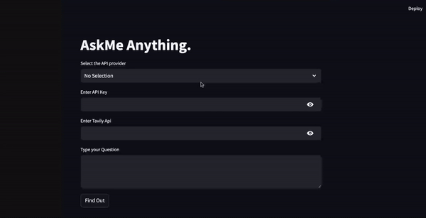

### AskMe Anything

AskMe Anything is a LLM-powered AI application designed to provide accurate answers to your questions by leveraging AI agents capable of searching the web for the latest information. This ensures that the responses are up-to-date and accurate, even for queries that the AI might not have immediate knowledge of.

This repository hosts a Streamlit application integrated with two Large Language Model (LLM) providers:
1. Groq
2. OpenAI

### Getting Started

To use this application, you'll need to create accounts and generate API keys from both Groq and OpenAI:

- Visit [Groq](https://groq.com/) to create a new account (if you don't already have one) and generate an API key.
- Similarly, visit [OpenAI](https://platform.openai.com/docs/overview) to create an account and generate an API key.

Additionally, the application utilizes the [Tavily](https://tavily.com/) search engine for enhanced search capabilities. To use this feature, you'll need to create an account on Tavily and obtain an API key.

### [Explore the Streamlit Application]( https://llmportfolio2.streamlit.app/)

