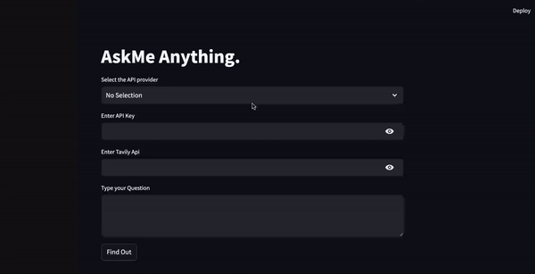

# AskMe Anything 🚀

**AskMe Anything** is an advanced AI-powered chatbot that integrates real-time web searches to answer user queries. By combining **Large Language Models (LLMs)** like **OpenAI** and **Groq** with the power of **AI Agents**, this app ensures you always receive the most accurate and up-to-date information. If the AI doesn’t know the answer, it fetches the latest data from the web in real-time, so you don’t have to.

This project uses **LangChain** for seamless LLM integration, **Streamlit** for an interactive user experience, and **Tavily** for enhanced search capabilities. Whether you need the latest tech news or answers to complex questions, **AskMe Anything** has got you covered!

---

## ✨ Key Features
- **Real-Time Web Search**: Automatically searches the web when the LLM lacks sufficient knowledge to answer your question.
- **Multi-Provider LLM Support**: Integrates two powerful LLM providers—**Groq** and **OpenAI**—to ensure diverse and comprehensive responses.
- **Interactive Streamlit Interface**: A sleek, user-friendly UI for easy interaction with the AI chatbot.
- **Web Search Integration**: Enhanced with **Tavily**, a search engine for fetching real-time answers and data.
- **Up-to-Date Information**: Get responses based on the most current data available online.

---

## 🚀 Demo

💥 **Live Demo Available!**  
Experience the magic of **AskMe Anything** in action by visiting the [Live Streamlit App](https://llmportfolio2.streamlit.app/).

---

## 🛠 Getting Started

### Prerequisites
Before you begin, you’ll need to set up API keys for the following services:

1. **Groq API Key**  
   - Sign up at [Groq](https://groq.com/) and generate your API key.

2. **OpenAI API Key**  
   - Sign up at [OpenAI](https://platform.openai.com/docs/overview) and create an API key.

3. **Tavily API Key**  
   - Get your API key by signing up at [Tavily](https://tavily.com/).

### Installation & Setup
1. Clone the repository:
   ```bash
   git clone https://github.com/PavanHebli/LangChain_SearchAgent.git
   ```

2. Navigate to the project folder:
   ```bash
   cd LangChain_SearchAgent
   ```

3. Install the dependencies:
   ```bash
   pip install -r requirements.txt
   ```

### Configuration
1. Launch the app using Streamlit:
   ```bash
   streamlit run SearchAgent.py
   ```

2. On the UI, input your **Groq**, **OpenAI**, and **Tavily API keys** in the provided fields. Simply paste the keys into the corresponding fields on the app to get started.

---

## 🎯 How to Use
1. Open the **AskMe Anything** Streamlit app.
2. Paste your **Groq**, **OpenAI**, and **Tavily API keys** into the designated fields on the UI.
3. Ask anything! Type your question into the text input and hit Enter.
   - If the LLM has the answer, it will provide it directly.
   - If not, the system will search the web for relevant, real-time answers and return the best match.
4. Get answers based on **accurate, real-time data**!

---

## 🎨 UI Preview

Here's a sneak peek of how it looks when you're interacting with the chatbot:



---

## 📄 License
This project is licensed under the **MIT License**.

---

## 👨‍💻 Built With
- **Streamlit**: For the web interface.
- **LangChain**: For seamless LLM integration.
- **Groq & OpenAI**: For LLM-based question answering.
- **Tavily**: For enhanced web search capabilities.

---

## 📣 Get Involved
Feel free to contribute by submitting issues, pull requests, or even suggesting improvements. Let’s make AI more accessible!

---

**Try it Now!** 🚀 [**AskMe Anything - Live Demo**](https://llmportfolio2.streamlit.app/)  
For more updates, follow me on [GitHub](https://github.com/PavanHebli).